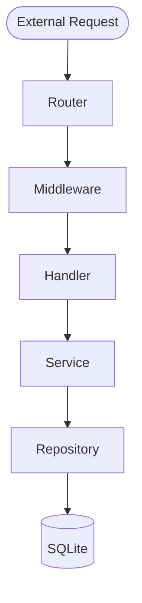

# Arquitetura do Projeto

Este projeto segue os princípios da **Clean Architecture** (Arquitetura Limpa), visando desaclopar a lógica de negócio de detalhes de implementação como frameworks web ou bancos de dados.

## Camadas

A comunicação flui de fora para dentro (External -> Handler -> Service -> Repository).

### 1. External (Router & Middleware)
- **Onde:** `internal/api/` e `internal/middleware/`.
- **Responsabilidade:** Configurar rotas, validar tokens (OIDC), logging e entregar a requisição pro Handler certo.

### 2. Interface Adapters (Handlers)
- **Onde:** `internal/handlers/`.
- **Responsabilidade:** "Traduzir" HTTP para Go. Lê JSON, valida inputs básicos e chama o Service.
- **Não deve ter:** Lógica de negócios complexa ou queries de banco.

### 3. Use Cases (Services)
- **Onde:** `internal/services/`.
- **Responsabilidade:** O coração da aplicação. Contém as regras de negócio.
- **Exemplo:** "Não pode criar produto sem nome", "Calcular desconto".

### 4. Entity / Frameworks (Repository)
- **Onde:** `internal/storage/`.
- **Responsabilidade:** Falar com o banco de dados.
- **Tecnologia:** GORM (mas poderia ser trocado por SQL puro sem afetar o resto).

## Estrutura de Pastas

| Pasta | Descrição |
|-------|-----------|
| `cmd/api` | Entrypoint. O `main.go` fica aqui. |
| `internal` | Código privado da aplicação (não importável por outros projetos Go). |

> [!NOTE]
> Esta estrutura segue o padrão da comunidade [golang-standards/project-layout](https://github.com/golang-standards/project-layout).
| `internal/api` | Configuração de Rotas e Versões (v1). |
| `internal/config` | Carregamento de variáveis de ambiente. |
| `internal/handlers`| Controladores HTTP. |
| `internal/middleware`| Interceptadores (Auth, Logger). |
| `internal/services` | Regras de Negócio. |
| `internal/storage` | Acesso a Dados. |
| `pkg` | Código utilitário genérico (ex: Logger setup) que pode ser reusado. |
| `docs` | Documentação do projeto. |
